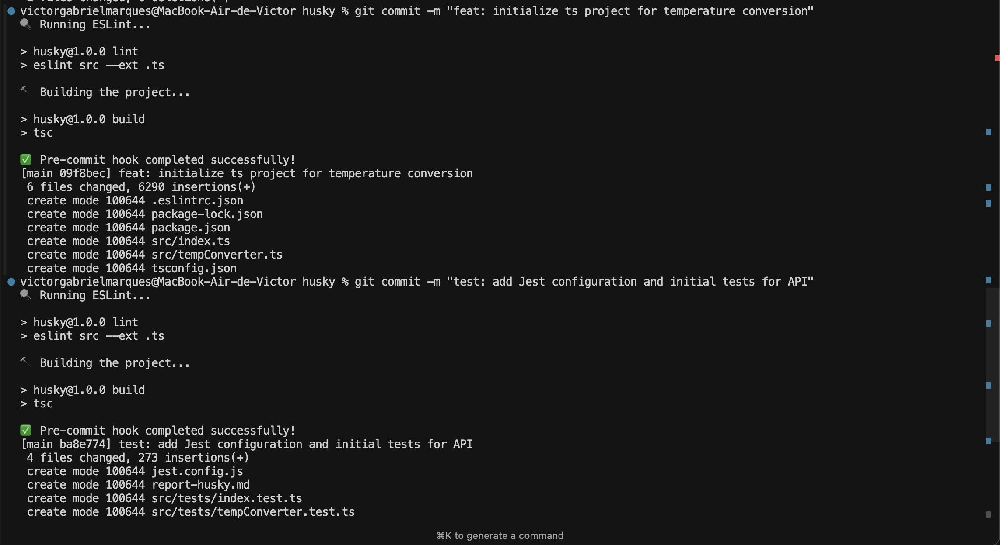
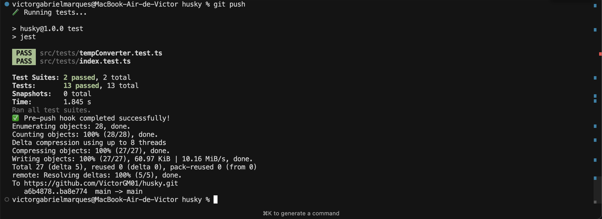

# Husky

## Configuração do Husky: Automatizando Boas Práticas na Integração Contínua

Este documento detalha o processo passo a passo de configuração do Husky no repositório para garantir verificações de qualidade de código por meio de hooks do Git.

## Configuração do Projeto

O projeto é uma API Node.js simples para conversão de temperatura (Fahrenheit para Celsius e vice-versa) construída com TypeScript.

### Configuração Inicial do Projeto

1. Inicialização de um novo projeto Node.js:

   ```bash
   npm init -y
   ```

2. Instalação das dependências necessárias:

   ```bash
   npm install --save express @types/express typescript ts-node jest @types/jest ts-jest eslint @typescript-eslint/parser @typescript-eslint/eslint-plugin supertest @types/supertest
   npm install --save-dev husky
   ```

3. Criação do arquivo de configuração TypeScript (`tsconfig.json`):

   ```json
   {
     "compilerOptions": {
       "target": "es6",
       "module": "commonjs",
       "outDir": "./dist",
       "rootDir": "./src",
       "strict": true,
       "esModuleInterop": true,
       "skipLibCheck": true,
       "forceConsistentCasingInFileNames": true
     },
     "include": ["src/**/*"],
     "exclude": ["node_modules", "**/*.test.ts"]
   }
   ```

4. Criação do arquivo de configuração ESLint (`.eslintrc.json`):

   ```json
   {
     "parser": "@typescript-eslint/parser",
     "extends": ["plugin:@typescript-eslint/recommended"],
     "parserOptions": {
       "ecmaVersion": 2020,
       "sourceType": "module"
     },
     "rules": {
       "no-console": "warn",
       "@typescript-eslint/no-unused-vars": "error"
     }
   }
   ```

5. Criação do arquivo de configuração Jest (`jest.config.js`):

   ```javascript
   module.exports = {
     preset: "ts-jest",
     testEnvironment: "node",
     testMatch: ["**/*.test.ts"],
   };
   ```

6. Atualização do `package.json` com os scripts adequados:
   ```json
   {
     "scripts": {
       "start": "node dist/index.js",
       "dev": "ts-node src/index.ts",
       "build": "tsc",
       "lint": "eslint src --ext .ts",
       "test": "jest",
       "prepare": "husky"
     }
   }
   ```

## Configuração do Husky

### 1. Inicialização do Husky

O Husky foi inicializado usando o seguinte comando:

```bash
npx husky init
```

Isso criou o diretório `.husky` com a configuração de hooks.

### 2. Criação do Hook Pre-commit

O hook pre-commit foi configurado para executar a verificação de linting e os processos de build para garantir a qualidade do código antes de qualquer commit:

1. Criação do arquivo `.husky/pre-commit`:

   ```bash
   echo "🔍 Executando ESLint..."
   npm run lint || exit 1

   echo "🔨 Compilando o projeto..."
   npm run build || exit 1

   echo "✅ Hook pre-commit concluído com sucesso!"
   ```

2. Tornando o hook executável:
   ```bash
   chmod +x .husky/pre-commit
   ```

### 3. Criação do Hook Pre-push

O hook pre-push foi configurado para executar testes e garantir que toda a funcionalidade funcione corretamente antes que o código seja enviado para o repositório:

1. Criação do arquivo `.husky/pre-push`:

   ```bash
   echo "🧪 Executando testes..."
   npm test || exit 1

   echo "✅ Hook pre-push concluído com sucesso!"
   ```

2. Tornando o hook executável:
   ```bash
   chmod +x .husky/pre-push
   ```

## Visão Geral do Código do Projeto

O projeto implementa uma API simples de conversão de temperatura com os seguintes componentes:

1. `src/tempConverter.ts` - Contém as funções de conversão de temperatura:

   - `convertFahrenheitToCelsius` - Converte Fahrenheit para Celsius
   - `convertCelsiusToFahrenheit` - Converte Celsius para Fahrenheit

2. `src/index.ts` - Aplicação Express com endpoints de API:

   - `GET /api/convert/ftoc/:temp` - Converte Fahrenheit para Celsius
   - `GET /api/convert/ctof/:temp` - Converte Celsius para Fahrenheit

3. Arquivos de teste:
   - `src/tests/tempConverter.test.ts` - Testes para funções de conversão
   - `src/tests/index.test.ts` - Testes para endpoints de API

## Hooks em Ação

### Hook Pre-commit

Quando um commit é feito, o hook pre-commit:

1. Executa o ESLint para verificar problemas de estilo de código
2. Compila o código TypeScript para garantir que ele seja compilado corretamente
3. Só permite o commit se ambas as verificações passarem



### Hook Pre-push

Quando o código é enviado para o repositório, o hook pre-push:

1. Executa todos os testes Jest para garantir que o código funcione corretamente
2. Só permite o push se todos os testes passarem



## Conclusão

Esta configuração do Husky garante que:

1. O código seja adequadamente lintado e siga o guia de estilo (pre-commit)
2. O código TypeScript compile com sucesso (pre-commit)
3. Todos os testes passem antes que o código seja enviado para o repositório central (pre-push)

Essas verificações ajudam a manter a qualidade do código e evitam que problemas sejam introduzidos na base de código.
